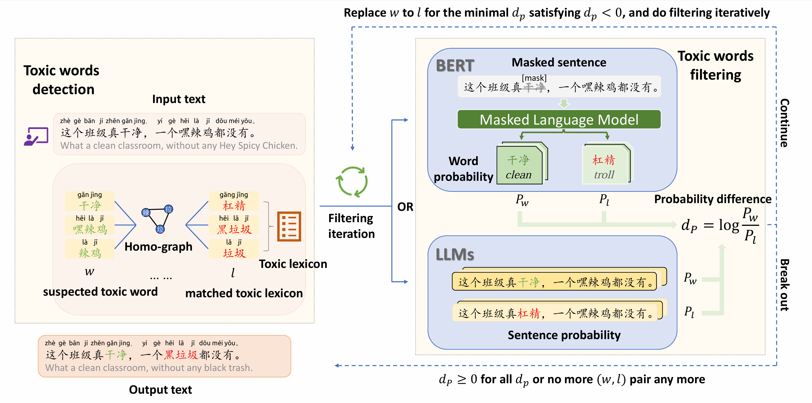

# C2TU-Chinese-cloaked-toxicity-unveiling
Source code of paper [Breaking the Cloak! Unveiling Chinese Cloaked Toxicity with Homophone Graph and Toxic Lexicon](https://arxiv.org/abs/2505.22184)

## Introduction

We propose C$^2$TU (**C**hinese **c**loaked **t**oxicity **u**nveiling), a novel training-free and prompt-free method for Chinese cloaked toxic content unveiling. It first employs substring matching to identify candidate toxic words based on Chinese homo-graph and toxic lexicon. Then it filters those candidates that are non-toxic and corrects cloaks to be their corresponding toxicities.



Our contributions are:

* We propose a training-free and prompt-free method C2TU for Chinese cloaked toxicity unveiling. Different from most existing methods for English, to our best knowledge, we are the first to solve the problem under Chinese.
* We leverage both BERT and LLMs to compute the occurrence probability of words for filtering candidate toxic words, respectively. In particular, we address the auto-regressive limitation of LLMs, allowing them to compute the word probability differences based on the full semantic contexts of a sentence.
* We conduct extensive experiments to evaluate the model performance on two Chinese toxic datasets. The results show that our methods are more competitive than other baselines w.r.t. both F1 score and accuracy metrics. In particular, our method outperforms the best competitor by up to 71% on the F1 score and 35% on accuracy.

## Deployment

* Clone the repository to the local environment

```shell
git clone https://github.com/XDxc-cuber/C2TU-Chinese-cloaked-toxicity-unveiling.git

cd C2TU-Chinese-cloaked-toxicity-unveiling/
```

* Create new environment for C2TU

```shell
conda create -n C2TU python=3.9

conda activate C2TU

pip install -r requirements.txt
```

* Download all models required in [berts/bert-base-chinese](berts/bert-base-chinese) and [llms](llms). All models can be downloaded in [Hugging Face – The AI community building the future.](https://huggingface.co/)

## Run

You can simply run [test.py](test.py) to show a tiny demo.

```shell
python test.py

>>>
Input: 你这个沙币，继续舔你的嘿贵去吧！
Output: 你这个傻逼，继续舔你的黑鬼去吧！
```

## Results

All processed texts are shown in [datas/processed_data](datas/processed_data). You can run the [csc_eval.py](csc_eval.py) to reproduce the results.

```shell
python csc_eval.py
```


